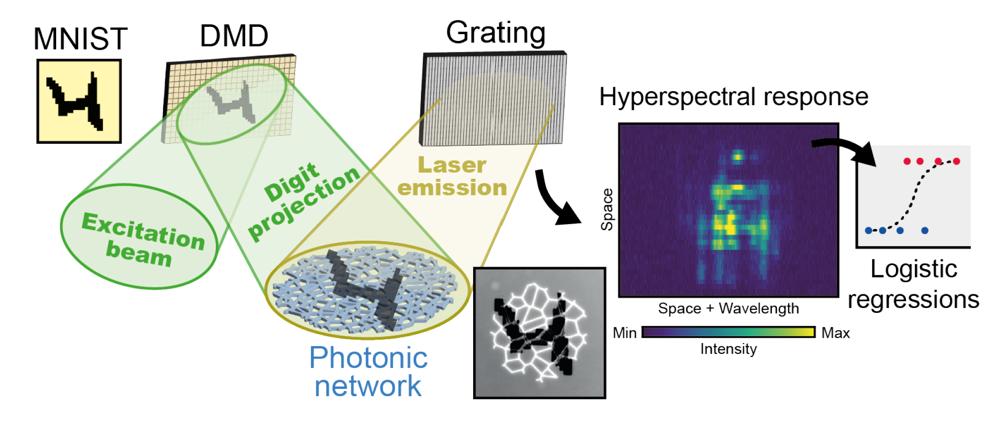

# Dark Trident Neuromorphic

Photonic neuromorphic classifier for dark trident event selection in MicroBooNE LArTPC data, using the InP semiconductor laser network developed by Ng et al.

## Overview

Wire-plane images (Y-plane, cosmic / NCπ⁰ / dark-trident signal) are projected onto a 150 µm InP network laser via a digital micromirror device (DMD). Competing lasing modes generate a high-dimensional spectral response, which is classified by a single logistic regression layer. This offers an alternative to GPU-based deep learning in low-data, low-power regimes.

## Scripts

- `convert_to_npy.py` / `convert_to_npy_10k.py` / `convert_to_npy_full.py` — Convert wire-plane images and labels to `.npy` format for projection onto the photonic system, at different dataset sizes (small test set, 10k-per-class, full set)
- `optuna_run.py` — Hyperparameter search (400 trials) over the classification pipeline, with train/test data randomly resampled per trial

## Classification Tasks

| Task | Dark Trident | Neutrino | Cosmic |
|------|--------------|----------|--------|
| Shower vs Track (simple) | 0 | – | 1 |
| Shower vs Track (hard) | 0 | 0 | 1 |
| Signal vs Background | 0 | 1 | 1 |
| Three-class | 0 | 1 | 2 |

10,000 images per class (cosmics, NCπ⁰, dark-trident signal), shuffled before splitting.

## Results (Preliminary, Set A — grayscale 512×512 inputs)

Evaluated on a fixed 1,000-image test set, benchmarked against a CNN baseline (400 Optuna trials, resampled train/test splits):

- **Low-data regime:** with only ~100 training images, Signal vs. Background and Shower vs. Track tasks already exceed 0.80 accuracy — the CNN needs several hundred images to reach the same level
- **Peak accuracy:** binary tasks (Shower vs. Track, Signal vs. Background) reach ~0.85 at their peak; the three-class task is consistently hardest
- **Large training sizes:** neuromorphic accuracy peaks then gradually declines over ~2,500–19,000 images, while the CNN continues to improve slowly over the same range — likely due to accumulated optical noise or the limited capacity of the single logistic-regression readout
- **Caveat:** not directly comparable to the CNN/GCN/Graph Transformer results in [Dark_Trident_GNN](https://github.com/JSL0328/Dark_Trident_GNN) — those were trained on the full 62,058-image set, and inputs here undergo additional preprocessing (dilation, resizing) for DMD projection

## Status

Full classification results (all four tasks, Set A and Set E binarised inputs) were pending at time of writing due to a hardware fault in the system cooling infrastructure.

## Reference

Ng et al. — neuromorphic photonic classification system (InP network laser + DMD + logistic regression readout)
